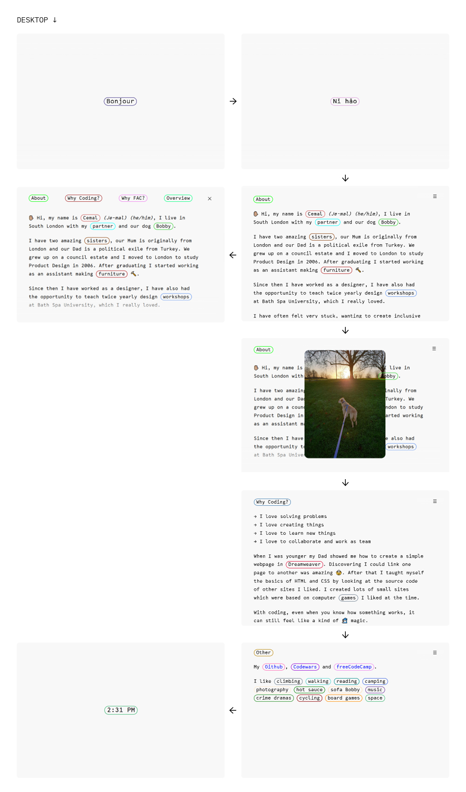

## 🌍 Project overview

This read-me documents my application website for the Founders and Coders (FAC) 2021 Autumn Cohort. I designed it to full fill the requirements set by FAC. I also wanted to create a website from scratch using the HTML, CSS and JavaScript I have learnt over the past few months. It gave me an opportunity to put into words why I want to learn more about coding and a join the FAC Autumn cohort. 🍁

## 📔 Contents

- [⌚ Project Timeline](#--project-timeline)
- [📃 Brief](#---brief)
- [💡 Design](#---design)
- [🦺 Testing](#---testing)
- [✔ Accessibility](#--accessibility)
- [📷 Image usage rights](#---image-usage-rights)
- [🔎 Brief Review](#---brief-review)
- [📚 What I learnt](#---what-i-learnt)
- [⏳ Things I would change](#--things-i-would-change)
- [🚙 Reflections and What Next](#---reflections-and-what-next)

---
## ⌚ Project Timeline
**🎨 Week 1 - Content and Design**

- Write content for site (About, Why FAC?, Why Coding?)
- Select image content
- Wire-frame initial design ideas
- Develop design ideas

**🔨 Week 2 - First Code Build**

- Begin coding site with HTML and CSS
- Code JavaScript functionality
- Test site and make changes

**🔧 Week 3 - Development**

- Refine design and functionality
- Refine/refactor JavaScript
- Comment code

**🏁 Week 4 - Testing and Deployment**

- Test site on desktop and mobile
- Write documentation
- Deploy to GitHub pages

---

## 📃 Brief

**🌌 General criteria**
- All code is written by you
- No external libraries (e.g. no Bootstrap, React or GitHub Pages themes, but external fonts/icons are fine)
- Tells us about why you are applying for the program
- Hosted on GitHub Pages
- Links back to the GitHub repository that contains the code for your site
- Links to your public freeCodeCamp profile
- Links to your Codewars profile

**💾 Technical criteria**
- Semantic HTML5 elements
- CSS grid or flex-box layout (or both)
- DOM event listeners for user interaction (e.g. click, key-down)
- DOM updates in response to user interaction (e.g. showing/hiding an element, changing text or styles)

**✋🏼 Personal criteria**
- Easy to read
- Easy to navigate
- Accessible
- Works on Smart Phones
- Tells a story with words and images
- Playful and colourful design
- Loads quickly

---

## 💡 Design

**📝 Feature and functionality ideas**

While working my way through freeCodeCamp and other resources I had ideas about how to use what I was learning. Along the way I would either write down my ideas or quickly try and code it. The following is a list of those ideas:

- Greeting to welcome to user in many langauges
- Background colour changes depending on section
- Navigation smooth scroll to different parts of the page
- Random colours applied to links border on page load so website feels different each time
- Progress indicator to show how far through the website you are
- Screensaver with time and location appears when website is left idle
- Use sticky CSS positioning for headers
- Images appear over text to add context to words
- Keyboard shortcuts to jump to next/prev section
- Font that is readable, with a 'coding' look
- Hidden Easter-egg like a computer game 🧙🏼‍♂️

**🖌 Sketch Layouts**

Early wire-frame sketch ideas, including some of the features and functionality above.

  

**🖌 Concept Layouts**

A more developed design which includes:
- Font choice
- Font size
- Concept for colour changing sections
- Link styling
- Concept for navigation
- Screensaver
- Greeting word
- Mobile navigation and font size
- Image over text

 
 

**🏁 Deployed site**

The final deployed site includes:

- Links appear above photos to add context to image
- Screensaver clock border changes colour every second to mimic a clock ticking
- When page hits 100% animated hand appears
- Clicking headings takes user to top of that section
- Sections do not change colour because it made the text difficult to read
- Neutral grey background colour
- Menu ☰ button and X to close
- Larger text size and full screen navigation on mobile

---

## 🦺 Testing

**🖱 Compatibility**

The site performs as designed on the latest versions of Mozilla Firefox, Google Chrome and Microsoft Edge.

Safari does not support `scrollIntoView()` so the pages jump suddenly between sections.

Firefox displays the `Date()` differently to Chrome and Edge:

- Chrome and Edge 06:15 PM 
- Firefox 6:15 PM

The site works well on Android, both Chrome and Firefox browsers. I have not had the opportunity to test it on a iOS based device.

**🏃🏼‍♀️ Performance**

I tested it using Google Chrome Lighthouse and made the changes it suggested, below is an image of the results. 

One of the factors effecting performance was the size of the animated GIFs. I wasn't able to reduce the size of animated GIFs as this would have meant hosting the files myself which is against Giphy's terms and conditions.

---

## ✔ Accessibility
I have tried to design the website with accessibility in mind:
- All images have descriptive alt-text
- Text size is large and easily readable
- Contrasting colours  (by using black text and grey background)
- Used headers and clear headings to structure content

Things that could improve accessibility:
- Include option to change text size
- Include option to use keyboard navigation
- Fix navigation in place

---

## 📷 Image usage rights
All images on the site are owned by myself or have a creative commons license which allows free use and distribution. 

Animated GIFs are from Giphy and follow their terms and conditions of use.

## 🔎 Brief Review

**🌌 General criteria**
- ✅ All code is written by you 
- ✅ No external libraries (e.g. no Bootstrap, React or GitHub Pages themes, but external fonts/icons are fine)
- ✅ Tells us about why you are applying for the program
- ✅ Hosted on GitHub Pages
- ✅ Links back to the GitHub repository that contains the code for your site
- ✅ Links to your public freeCodeCamp profile
- ✅ Links to your Codewars profile

**💾 Technical criteria**
- ✅ Semantic HTML5 elements
- ✅ CSS grid or flex-box layout (or both)
- ✅ DOM event listeners for user interaction (e.g. click, key-down)
- ✅ DOM updates in response to user interaction (e.g. showing/hiding an element, changing text or styles)

**✋🏼 Personal criteria**
- ✅ Single page
- ✅ Accessible
- ✅ Works on Smart Phones
- ✅ Easy to read
- ✅ Easy to navigate
- ✅ Tells a story with words and images
- ✅ Playful and colourful design
- ✅ Loads quickly

---

## 📚 What I learnt

Through the creation of this site I learnt the basics of the following:

- Planning the layout and functions of a site
- Organising and structuring code
- Basics of commenting code
- Timing events with `setTimeout()`, `setInterval()` and `clearTimeout()`
- Bubbling events 
- Events triggered by page location using `getBoundingClientRect()`
- Data attributes
- Retrieving current time with `Date()` in different formats
- `IntersectionObserver()`
- `scrollIntoView()` with smooth scroll
- `eval()` function
- Iterating through a NodeList
- Flexbox
- CSS animations
- CSS transitions
- Viewport width and viewport height
- I also learnt that I really love coding ❤

---

## ⏳ Things I would change

- Code alternative for `scrollIntoView()` to work with Safari
- Use RGB values instead of colour names for a wider range of random colours
- Pre-load images, maybe with Greeting words being a preload screen
- Include keyboard navigation
- More testing on different browsers and devices

---

## 🚙 Reflections and What Next

- I am proud of myself and pleased to have been part of the application process
- I am now more motivated to learn to code
- I would love to learn React and Node
- I would like my next project to be something to help the world
